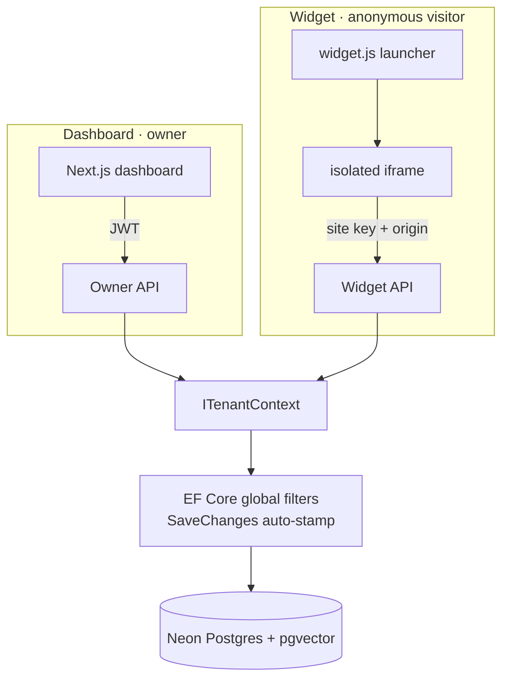

# AI-Powered Customer Support Agent

**A multi-tenant SaaS that turns a small business's own FAQs, services, and policies into a deployable AI chat widget — grounded answers, an embeddable script tag, and a "needs a human" handoff that captures unresolved chats as leads.**

[](https://ai-support-agent-three.vercel.app/)


---

## Two doors into the demo

> The heartbeat keeps the instance warm, so the demo answers instantly — no cold start when you click.

- **Chat with the live agent** → [ai-support-agent-three.vercel.app](https://ai-support-agent-three.vercel.app/) — you're a customer of a fictional coffee roastery. Ask about shipping, returns, or blends and watch it answer from the roastery's knowledge. Ask something it can't know ("can you cater my wedding?") and watch it offer a human handoff and capture your details as a lead.
- **Explore the dashboard (read-only)** → [open the demo](https://ai-support-agent-three.vercel.app/), click **Explore the demo** — see the owner's side: the structured knowledge base, the conversation log with **per-turn grounding metadata** (which chunks were retrieved, the confidence score, the model used), and the captured leads.

<!-- TODO: looping GIF — grounded answer → out-of-scope question → handoff → lead capture -->

---

## What it does

A business owner enters their knowledge as **structured, typed content** (FAQs, services/products, policies, a business profile) — never a free-form wall of text. That content is chunked, embedded, and stored as vectors. When a visitor asks a question, the agent retrieves the most relevant chunks of _that tenant's_ knowledge and generates an answer grounded strictly in them. When it can't answer confidently, or the visitor asks for a person, the conversation becomes a lead.

Four verbs: **configure → ground → converse → escape-hatch.**

**Example interactions (against the demo roastery):**

| Visitor asks                                  | What happens                                                                   |
| --------------------------------------------- | ------------------------------------------------------------------------------ |
| "Do you ship to the UK?"                      | Grounded answer from the shipping FAQ, with the source shown in the dashboard. |
| "What's the difference between your blends?"  | Synthesised from the two product entries.                                      |
| "Can you make a custom blend for my wedding?" | No confident grounding → soft handoff offer → contact form → lead.             |
| "I'd like to talk to a person."               | Explicit handoff → lead capture.                                               |

---

## How it works

### The RAG turn lifecycle

Every visitor message runs through a **gate before any model call**, which is how the answer streams cleanly without JSON-wrapping or a second classification request — the handoff decision is made in code, not asked of the model.

```mermaid
flowchart LR
  A[Visitor message] --> B{Explicit "talk to a human"?}
  B -- yes --> H[Handoff → lead]
  B -- no --> C[Embed query · in-process]
  C --> D[Vector search · tenant-scoped]
  D --> E{Top similarity ≥ floor?}
  E -- no --> H
  E -- yes --> F[Assemble grounded prompt]
  F --> G[Stream answer · SSE]
  G --> P{Model refused?}
  P -- yes --> H
  P -- no --> L[Log turn + grounding metadata]
```

### Two trust postures, one enforcement point

The dashboard is owner-authenticated; the public widget is anonymous. Both resolve a tenant, and **every database read is scoped by it centrally** — via EF Core global query filters and a `SaveChanges` auto-stamp — so isolation is a property of the infrastructure, not of whoever wrote the latest query.



### Stack

| Layer            | Choice                                                                            |
| ---------------- | --------------------------------------------------------------------------------- |
| Frontend         | Next.js (React) — dashboard + embeddable widget                                   |
| Backend          | ASP.NET Core (.NET 10), EF Core, Minimal APIs                                     |
| Auth             | ASP.NET Core Identity + JWT (dashboard) · site-key + origin (widget)              |
| Database         | Neon Postgres + **pgvector** (HNSW, cosine)                                       |
| Embeddings       | **In-process ONNX** (`all-MiniLM-L6-v2`, 384-dim) behind an `IEmbedder` seam      |
| Generation       | **OpenRouter** (OpenAI-compatible), config-driven fallback chain, per-tenant BYOK |
| Email            | Resend                                                                            |
| Hosting          | Vercel (frontend) · Render (API) · GitHub Actions heartbeat                       |
| **Monthly cost** | **$0**                                                                            |

---

## Notable engineering decisions

**Multi-tenant filtered vector search — the trap and the fix.** An approximate index (HNSW) applies the tenant filter _after_ the scan, so a small tenant's chunks can fall outside the top candidates and return nothing — the agent says "I don't know" to something it actually knows. The fix is **pgvector 0.8 iterative scans** (`hnsw.iterative_scan = 'relaxed_order'`), set at the database level, which keeps scanning until enough tenant-matching results are found. The distance function stays LINQ-translatable (`Chunks.OrderBy(c => c.Embedding.CosineDistance(q))`) specifically so the global tenant filter is injected automatically — no raw SQL that could bypass it.

**In-process embeddings on the hot path — measured, not assumed.** Every visitor message is embedded before search, so a flaky third-party embedding API would stall the demo on every turn. The model runs inside the API process via ONNX Runtime instead. Measured on the dev machine: **p50 ≈ 8ms, p95 ≈ 31ms** per embed, **~170MB working set** for the whole process with the model loaded — comfortably inside Render's 512MB free tier. The choice is reversible at a single integration point (`IEmbedder`) to a hosted fallback if ever needed; it hasn't been.

**Pre-generation gating keeps streaming clean.** The handoff signal (explicit-intent + retrieval-floor) is computed server-side _before_ the model is called, with a mandated refusal phrase as a post-stream backstop. Per-turn metadata (retrieved chunk ids, similarity, model, latency, grounded?) is captured in code and stored on each message — the model is only ever asked to write the answer.

**Encrypted secrets that survive redeploys.** Per-tenant BYOK keys are encrypted with ASP.NET Core Data Protection, and the **key ring is persisted to Postgres** — the default ephemeral filesystem would make every secret undecryptable after a redeploy.

**Abuse & cost control on a shared free key.** Origin allowlist + per-tenant CORS, partitioned rate limiting (with forwarded-headers so the limiter sees real client IPs behind the proxy), and date-keyed daily quotas — no scheduler needed. When a quota is hit, the agent **degrades gracefully into a lead** rather than erroring.

**Zero-cost deploy, kept warm.** A GitHub Actions heartbeat pings `/health` so the instance, the loaded model, and Neon's compute stay warm — the demo is instant and the whole thing runs at $0/month.

---

## Scope

**In:** owner auth + one-tenant-per-owner; structured typed knowledge (FAQ / service / policy / business profile) with synchronous chunk-and-embed; RAG chat with streaming; confidence-and-intent-based handoff; lead capture + owner email; conversation log with grounding metadata; leads view; embeddable widget (vanilla launcher + isolated iframe); rate limiting, quotas, origin allowlist; read-only seeded demo.

**Deliberately out (and why):** live agent takeover (a separate product, demonstrates nothing about RAG — v1 handoff is asynchronous); file/URL ingestion (the embedding pipeline is identical regardless of source, so structured input proves it); multi-user teams, billing, other channels, query-rewriting for follow-ups. These are documented stretches, not gaps.

---

## Run it locally

**Prerequisites:** .NET 10 SDK, Node ≥ 20.9, a free Neon project (with `pgvector`), an OpenRouter API key, a Resend API key.

```bash
# 1. API
cd src/Api/AiSupportAgent.Api
dotnet user-secrets set "ConnectionStrings:DefaultConnection" "<neon connection string>"
dotnet user-secrets set "Jwt:SigningKey" "<a long random string>"
dotnet user-secrets set "Rag:SharedApiKey" "<openrouter key>"
dotnet user-secrets set "Email:ApiKey" "<resend key>"
dotnet ef database update          # creates the schema (CREATE EXTENSION vector runs first)
dotnet run                          # seeds the demo tenant on first boot — note the SITE KEY in the logs
```

```sql
-- one-time, in the Neon SQL editor (enables the multi-tenant search fix)
ALTER DATABASE neondb SET hnsw.iterative_scan = 'relaxed_order';
```

```bash
# 2. Frontend
cd src/web
echo "NEXT_PUBLIC_API_BASE_URL=http://localhost:5080" > .env.local
npm install && npm run dev          # http://localhost:3000
```

The embedding model (`model.onnx` + `vocab.txt`) is committed to the repo, so there's nothing to download.

---

## Project structure

A clean monolith with five domain folders plus the RAG and widget seams:

```
src/Api/AiSupportAgent.Api/
  Identity/        auth, JWT, refresh tokens
  Tenancy/         tenant, agent config, site key, BYOK credential
  Knowledge/       typed knowledge, chunking, IEmbedder (ONNX), retrieval
  Conversations/   conversations, messages, owner conversation API
  Leads/           leads + status management
  Rag/             prompt builder, IChatClient (OpenRouter), gate, SSE
  Widget/          public site-key API, session tokens
  Common/          tenant context, Data Protection, email, demo guard
  Persistence/     DbContext, global filters, migrations, demo seeder
src/web/           Next.js dashboard + /embed widget app + widget.js
```

---

## About

Built by **Jason Davids** — full-stack developer (Angular / React · .NET · Postgres).
GitHub: [JasonD21](https://github.com/JasonD21) · LinkedIn: [Jason Davids](https://www.linkedin.com/in/jason-davids-09aa201b0/)

One of three portfolio projects demonstrating production SaaS patterns end to end.

## License

MIT
