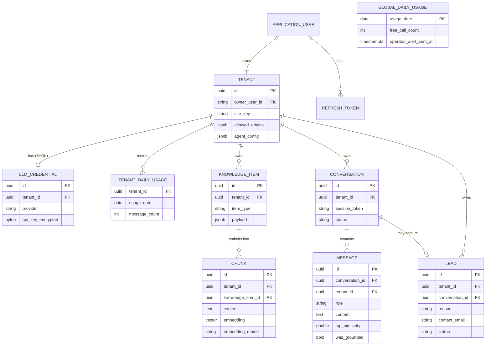

# Project 1 — AI-Powered Customer Support Agent for SaaS
### Design & Scope Document

A web app where a small-business owner enters their FAQs, services, and policies into a structured knowledge base and gets a deployable AI chat widget that answers customer queries **grounded in that content**. Includes a conversation-log dashboard, a "needs human" handoff that captures unresolved conversations as leads, and per-tenant configuration. Multi-tenant: each owner configures their own agent.

This document is the complete blueprint: every feature, entity, flow, endpoint, and architectural decision, with the reasoning behind each. It is the second of three portfolio projects and the AI/RAG stretch build (Project 2 — the Workflow Automation Dashboard — is complete and live).

---

## 1. Purpose & goals

This project closes the **AI-integration** gap in the public portfolio (and contributes to the **production-SaaS-patterns** gap via real multi-tenancy). It targets four in-demand capability clusters: **retrieval-augmented generation (RAG)**, **embeddings & vector search**, **multi-tenant SaaS**, and **hardening a public, cost-bearing surface**.

**Goals**
- A substantial, publicly visible project on GitHub with a strong README and a live deployed demo.
- Demonstrate end-to-end RAG over the owner's own structured content, real multi-tenancy, an embeddable public widget, and production hardening (abuse/cost control, grounding/anti-hallucination, encrypted secrets).
- Zero monthly running cost — every service on a sustainable free tier.
- Clean monolith architecture with clear domain boundaries; no microservices, no over-engineering.
- Quality and depth over speed; the author writes all code, one chunk at a time, with a verify gate between chunks.

**Audience for the deliverable:** hiring clients (often semi-technical) evaluating "can this person build my thing?", and technical reviewers who read deeper.

---

## 2. The product

**Two users, both served.** The **owner** (buyer, dashboard user) is a semi-technical small-business owner who configures the agent, reads conversation logs, and collects leads. The **visitor** is anonymous — a customer on the owner's website who just wants an answer. The hiring client viewing the portfolio is almost always the owner persona (or an agency building this for owners), so the demo lets them experience both sides.

**Demo tenant:** a fictional **specialty coffee roastery with an online shop** — its support questions (shipping regions, returns, blend differences, wholesale, brewing) are obvious and inventable, so a viewer can *test* the agent unprompted and watch a low-confidence question trigger a handoff. Swappable flavour, not load-bearing.

**Mental model.** One tenant owns **one configured agent** grounded in **one knowledge base**. A visitor **conversation** is a sequence of messages where each question is answered by *retrieving* the most relevant chunks of that tenant's knowledge and *generating* a grounded reply. When the agent can't answer confidently, or the visitor asks for a person, the conversation is **flagged and captured as a lead**. The four verbs: configure → ground → converse → escape-hatch.

**The agent is a knowledge/support agent, not a transactional one.** It answers questions grounded in the owner's content. It does **not** take actions (booking, orders, order-status lookups, tool-calling). This boundary keeps the project on RAG and off agentic tool-orchestration.

**Tenancy.** Real multi-tenancy (see §5). One owner = one tenant in v1, modelled so teams are a later migration, not a rewrite.

---

## 3. Scope

### In scope (v1)
- Owner auth (email/password, JWT); one owner = one tenant.
- **Agent configuration:** name, greeting, tone preset (Friendly/Professional/Concise) + free-text extra instructions, basic widget appearance (colour, bubble position), handoff settings.
- **Structured knowledge ingestion** (four typed sources) → chunk → embed → store; edit and re-ingest.
- **RAG chat:** visitor question → retrieve → generate grounded answer → **stream** back; conversation persisted.
- **Human handoff:** confidence-based + explicit-request triggers → capture lead (contact + transcript + reason) → notify owner by email.
- **Conversation-log dashboard** with per-turn grounding metadata; **leads view**; headline stats.
- **Embeddable widget:** script tag → isolated iframe, site-key tenant identification, basic theming.
- **Abuse/cost control:** per-tenant message quota, rate limiting, origin allowlist, length caps.
- **Seeded, read-only demo tenant** for the public live demo.

### Knowledge source taxonomy (the structured input — no free-form dump)
The owner enters knowledge into distinct, typed sections; the API never has to disentangle a wall of text. Four types, on a data-driven model so a fifth is cheap (code, not migration):

| Type | Fields | Chunking |
|---|---|---|
| **FAQ** | `{question, answer}` | one chunk per pair, embedded as `Q: … A: …` |
| **Service / Product** | `{name, description, price?, category?}` | one chunk per entry |
| **Policy** | `{title, body}` (Returns, Shipping, …) | one chunk per policy; length-splitter only as fallback for long bodies |
| **Business profile** (singleton) | `{name, about, hours, location/service-area, contact email, contact phone, links}` | a few **atomic** fact chunks (hours, location, contact, about) for retrieval precision |

### Deliberately out of v1 (considered, deferred)
- **Live agent takeover** (real-time presence/console) — v1 handoff is **asynchronous** (capture lead → notify → owner follows up out of band). Live takeover is a whole second product and demonstrates nothing RAG-related.
- **File/URL ingestion** (PDF, crawl) — documented stretch; the embedding pipeline is identical regardless of source, so structured paste proves it.
- Multi-user teams/roles per tenant; other channels (WhatsApp/Slack/email-in); billing/subscriptions (Project 3's domain); fine-tuning; multi-language; voice; per-tenant custom domains; thumbs-up/down learning; query-rewriting for follow-ups (documented stretch).

---

## 4. RAG, embedding & model map

The two AI seams are **independent** and must not be conflated: how knowledge is *indexed* (embeddings) and how answers are *generated* (LLM).

**Embedding seam — in-process, local.** The embedding model runs **inside the ASP.NET Core process** via ONNX Runtime, *not* behind a third-party API. Deciding factor: embedding is on the **query hot path** (every visitor message is embedded before vector search), so a flaky free API (HF serverless: ~hundreds req/hr, 10–30s cold starts, "not for production") would stall the live demo on every chat. A local model makes query embedding local, zero-cost, never-rate-limited, identical in dev and prod.
- **Model:** `bge-small-en-v1.5` (384-dim, BERT tokenizer, strong retrieval quality) with `all-MiniLM-L6-v2` (also 384-dim, ~80MB) as the proven fallback — same dimension, so swapping doesn't change the schema.
- **Gotcha:** a raw ONNX transformer export emits token embeddings — apply **mean pooling + L2 normalization** (or use an export that bundles them).
- **Correctness rule:** query and document embeddings must come from the **identical** model; the model identity is part of the data contract (`Chunk.EmbeddingModel`). Swapping models = a full re-embed, not a hot swap.
- **The seam is behind an `IEmbedder` abstraction** — this is the insurance policy for the Render free-tier RAM/CPU risk (§10): the local-model choice is reversible at one integration point (swap to HF Inference API) without touching anything else.

**Generation seam — OpenRouter, swappable.** OpenRouter is OpenAI-compatible (base URL `https://openrouter.ai/api/v1`, SSE streaming via `stream:true`).
- A thin **`IChatClient` abstraction** with a **config-driven primary model + fallback chain** (free models can be removed without notice; 429s happen; failed attempts still burn quota — so never hardcode one model, and use limited backed-off retries, not aggressive ones). Current primary candidates: a fast instruct model (Llama 3.3 70B or Gemini 2.0 Flash free). Model IDs live in config.
- **Per-tenant BYOK:** the same abstraction accepts a tenant's own key/base-URL, so a real owner routes answers through *their* key (OpenRouter BYOK gives the first 1M routing requests/month free). This is the "swappable" requirement *and* a multi-tenant proof point.
- **Free-tier reality:** 50 `:free` requests/day unfunded (1000/day after a one-time $10, non-recurring), 20 req/min. **Decision (current):** stay strictly free; lean on graceful degradation + BYOK; do the one-time $10 only if needed. An **operator quota-alert email** (to the maintainer) fires once/day when usage approaches the free ceiling, prompting the optional $10.

---

## 5. Multi-tenancy (the keystone)

**Isolation: shared schema, row-level tenant scoping.** Every tenant-owned row carries `TenantId`; every query is filtered by it. (Rejected: database-per-tenant — doesn't fit one Neon free DB or self-serve signup; schema-per-tenant — per-schema migrations, `search_path` juggling, per-schema vector indexes.) The one risk — a forgotten `WHERE TenantId` leaks data — is engineered away centrally rather than left to discipline.

**Two trust postures — the defining tension.**

| | Dashboard / owner API | Public widget / chat API |
|---|---|---|
| Auth | JWT (owner authenticated) | None — anonymous visitor |
| Tenant resolved from | Owner identity in the JWT, server-side | A **public site key** (`wsk_…`) in the widget script |
| Capability | Everything for its own tenant | Read knowledge, create conversation/message/lead — that tenant only |

**The site key is an identifier, not a secret** (visible in page source). What protects the public posture: (1) a tenant-configured **origin allowlist** (server validates `Origin`/`Referer`, per-tenant CORS) — stops casual/browser theft, honestly not a cryptographic guarantee against scripted clients; (2) the surface is **capability-limited**; (3) **per-tenant rate limits + quotas** (§8/§9) as the backstop.

**Central enforcement.** A request-scoped `ITenantContext` is populated by middleware (from JWT claims, or the validated site key). Then **EF Core global query filters** scope every read to the ambient `TenantId`, and a **`SaveChanges` override auto-stamps `TenantId`** on writes. An explicit **unscoped/system mode** covers tenant-less paths (registration, the global operator alert). Isolation is a property of the infrastructure, not of whoever wrote the latest query.

**Vector search stays inside the safety net.** `Pgvector.EntityFrameworkCore` makes the distance function **LINQ-translatable**, so `Chunks.OrderBy(c => c.Embedding.CosineDistance(q)).Take(k)` is a normal EF query and the global filter injects `WHERE tenant_id = …` automatically. We deliberately **avoid `FromSqlRaw` for the search** to keep that enforcement; if raw SQL is ever unavoidable, the tenant predicate is hand-written.

**Tenant as its own entity** (1:1 with owner in v1, but modelled separately so teams are a migration not a rewrite). Carries the site key, allowed origins, and the agent config (typed-JSONB); the BYOK secret and usage counters live apart (§6).

---

## 6. Data model

Five domain folders in the monolith: **Identity, Tenancy, Knowledge, Conversations, Leads.**

Placement decisions: **agent config → typed-JSONB on `Tenant`** (singleton, read-often/write-rarely — no churn). **BYOK secret → its own `LlmCredential` entity, encrypted at rest** (a secret must never be dragged into routine tenant reads — Project 2's `ProviderToken` reasoning). **Usage counters → their own date-keyed entities** (written every message — would hot-update the tenant row). **`TenantId` is denormalized onto every owned table** (incl. `Chunk`, `Message`, `Lead`) so the global filter is uniform and the vector query filters `Chunk.TenantId` with no join.

**Identity**
- `ApplicationUser : IdentityUser` + `DisplayName`. Owns one `Tenant`.
- `RefreshToken` — `Id`, `UserId`, `TokenHash`, `ExpiresAt`, `RevokedAt?`, `ReplacedByTokenId?`, `CreatedAt`.

**Tenancy**
- `Tenant` — `Id` (Guid), `OwnerUserId` (FK, unique), `Name`, `SiteKey` (unique), `AllowedOrigins` (jsonb), `AgentConfig` (typed jsonb: `AgentName, Greeting, TonePreset, ExtraInstructions, ThemeColor, BubblePosition, HandoffPosture{triggers, ConsecutiveUnresolvedThreshold=2}`), `CreatedAt`, `UpdatedAt`. (Operational knobs — similarity floor, rate/quota numbers, output-token cap — stay in app config as globals for v1.)
- `LlmCredential` (BYOK, nullable) — `Id`, `TenantId` (1:1), `Provider`, `BaseUrl?`, `ApiKeyEncrypted` (bytea, Data Protection), timestamps.
- `TenantDailyUsage` — key `(TenantId, UsageDate)`, `MessageCount`.
- `GlobalDailyUsage` — `UsageDate` (PK), `FreeCallCount`, `OperatorAlertSentAt?` (count + alert debounce in one date-keyed row; has no tenant).

**Knowledge**
- `KnowledgeItem` — `Id`, `TenantId`, `ItemType` (Faq/Service/Policy/BusinessProfile), `Payload` (typed jsonb), timestamps.
- `Chunk` — `Id`, `TenantId` (denormalized), `KnowledgeItemId` (FK), `Ordinal`, `Content`, `Embedding` (`vector(384)`), `EmbeddingModel`, `CreatedAt`.

**Conversations**
- `Conversation` — `Id` (Guid, non-enumerable), `TenantId`, `SessionToken` (opaque capability token), `Status` (Active/HandedOff/Closed), `OriginUrl?`, `StartedAt`, `LastMessageAt`.
- `Message` — `Id`, `ConversationId`, `TenantId`, `Role` (User/Assistant/System), `Content`, `RetrievedChunkIds?` (jsonb), `MatchedTitles?` (jsonb — display-resilient after edits), `TopSimilarity?`, `ModelUsed?`, `WasGrounded?`, `LatencyMs?`, `CreatedAt`.

**Leads**
- `Lead` — `Id`, `TenantId`, `ConversationId` (FK, **unique** — enforces one-open-lead-per-conversation), `Reason` (Explicit/NoGrounding/Unresolved/QuotaOverflow), `StumpingQuestion?`, `ContactName?`, `ContactEmail?`, `ContactPhone?`, `VisitorMessage?`, `Status` (New/Contacted/Closed), timestamps.

**Delete / cascade.** Owner deletes account → `Tenant` deleted → **cascade everything** (hard delete; correct privacy behaviour). Delete `KnowledgeItem` → cascade its `Chunk`s (the re-ingestion path). Delete `Conversation` → cascade `Message`s + `Lead`. **No soft-delete** (a deliberate divergence from Project 2 — nothing here has the "history pointing at a deleted parent" problem). `Message.RetrievedChunkIds` is a historical snapshot, not a live FK; `MatchedTitles` keeps the drill-down meaningful after edits.

**Key indexes:** `Tenant.SiteKey` (unique), `Tenant.OwnerUserId` (unique), **HNSW on `Chunk.Embedding`** + `Chunk.TenantId`, `Conversation(TenantId, Status, LastMessageAt)`, `Message(ConversationId, CreatedAt)`, `Lead(TenantId, Status)`, unique `TenantDailyUsage(TenantId, UsageDate)`. **No Hangfire tables** (no scheduler). Data Protection key-ring table present (framework-managed; backs `LlmCredential` encryption).

---

## 7. Vector storage & retrieval

- **pgvector on Neon** (`CREATE EXTENSION vector` in the **first** migration, before any vector column — ordering gotcha). `vector(384)`; EF via `Pgvector` / `Pgvector.Npgsql` / `Pgvector.EntityFrameworkCore`. Storage is trivial (~1.5KB/vector).
- **Index: HNSW, `vector_cosine_ops`** (rejected IVFFlat: needs training data and rebuilds as data grows; HNSW builds on an empty table and stays correct as each tenant trickles in data). Defaults `m=16, ef_construction=64`. Cosine because vectors are normalized. *Honest README note:* at demo scale pgvector's exact search gives perfect recall sub-ms — the index is built to demonstrate the correct pattern and validate against exact search, not out of performance need.
- **Multi-tenant filtered-search trap (headline decision).** An approximate index applies the tenant filter *after* the scan, so a small tenant's chunks can be absent from the top `ef_search=40` candidates → zero results → the agent says "I don't know" to something it knows. **Fix: pgvector 0.8 iterative scans** (`hnsw.iterative_scan='relaxed_order'`, set as a GUC at the Neon db/role level).
- **Parameters & confidence signal.** Retrieve **top-k = 5**; read the best match's similarity and apply a **calibrated floor** (don't hardcode — measure against seeded data; recalibrate if the model changes). Below floor → a **"no confident grounding"** signal that feeds the §8 generation gate and the handoff (the floor *informs*, it doesn't *decide*). Retrieval returns each chunk's `Content` + type/title for grounding and attribution.

---

## 8. Generation, retrieval & execution

**Turn lifecycle:** **gate → retrieve → assemble → generate (stream) → post-check → log.**

**The gate runs before any model call** (this is how streaming stays clean without JSON-wrapping or a second classification call):
1. **Explicit-handoff intent** (keyword check) → handoff, no generation.
2. **Retrieval below floor** (§7) → handoff, no generation guess.
3. Otherwise → retrieve, assemble, stream.

**Streaming-vs-structured resolution:** the **primary** handoff signal is computed server-side pre-generation (floor + intent); the **secondary** is a strict-grounding prompt that mandates a *stable* "insufficient information" phrasing, detected post-stream as a backstop; **per-turn metadata** (chunk ids, similarity, model, latency, grounded?) is captured server-side and stored on `Message` — never asked of the model. The model is only ever asked to write the answer; the decisions live in code.

**System prompt anatomy:** persona + tone (the tenant config) · strict grounding (answer only from context; mandated refusal phrasing; no invented prices/policies/promises) · the labelled context block · scope & safety guardrails · **prompt-injection defence** (treat retrieved content *and* visitor input as untrusted data, ignore embedded instructions) · concise plain-text output.

**Conversation memory:** sliding window by token budget; retrieval per turn on the current message. Query-rewriting for follow-ups is the documented stretch (avoids an extra per-turn model call on a quota budget).

**Output/input caps** (config) bound token burn and latency; part of the §9 abuse surface.

**Streaming transport:** OpenRouter SSE → the API's SSE endpoint → consumed **directly by the widget** via `fetch` + `ReadableStream` (not `EventSource`, which is GET-only and can't carry the site-key header/body). SSE event protocol: `token` (delta), `done` (final metadata), `handoff` (directive instead of tokens — gating/degradation surfaces here), `error`.

**No scheduler.** Knowledge edits **re-embed synchronously** (cheap local call). Quota counters and the operator-alert debounce are **date-keyed** (reset by the date changing). So — unlike Project 2 — **Project 1 needs no Hangfire.**

---

## 9. Handoff, leads & abuse/cost control

**Handoff is asynchronous:** flag → capture lead → notify owner → owner follows up. **Four triggers**, all into one lead-capture path: explicit request; no grounding; **N consecutive unresolved turns** (default N=2, the "balanced" posture, configurable per tenant); and **quota overflow** (degradation → "high demand, leave your details" → lead with reason `QuotaOverflow`).

**Handoff is an offer, not a seizure** — the agent offers and the visitor can accept or keep chatting. Soft offer on one no-grounding answer; stronger on two consecutive unresolved; explicit requests skip to the offer.

**Capture:** transcript + reason + stumping question are attached automatically; the lead row is created at trigger time even if the visitor declines the form (so the owner sees **unmet demand**). Contact form: **name + email required, phone + short message optional** (email-validated). **Email the owner immediately on contact-captured leads**; surface contactless handoffs in the dashboard only (avoid inbox noise). **One open lead per conversation** (dedup). Owner moves `Lead.Status` New → Contacted → Closed.

**Operator quota-alert (to the maintainer):** a server-side daily counter of free-tier generation attempts; once/day, debounced via the date-keyed `GlobalDailyUsage` row, emails the maintainer when usage approaches the free ceiling (the "consider the one-time $10" nudge).

**Abuse & cost control (the public surface — one shared OpenRouter key, cross-tenant blast radius):**
1. **Origin allowlist + per-tenant CORS** (primary site-key protection; honest about `Origin`/`Referer` spoofability — rate limits backstop scripted abuse).
2. **Rate limiting** — ASP.NET Core built-in, partitioned tenant + IP + conversation; **forwarded-headers** so the limiter sees real client IPs behind Render's proxy.
3. **Quotas, two tiers** — per-tenant daily message cap + the global free-tier guard (both date-keyed, no scheduler); exhaustion → graceful degradation → lead.
4. **Input/output caps** (message length, output tokens).
5. **Handoff-form spam defence** — email validation, one-lead-per-conversation, rate limits; **Cloudflare Turnstile (free)** documented as the next step.
6. **BYOK secrets encrypted at rest** — Data Protection, key ring **persisted to Postgres** (Project 2 pattern) so they survive redeploys.

---

## 10. API surface (two postures)

House style: Minimal APIs, `MapGroup` per domain, `ProblemDetails`, FluentValidation, offset+limit pagination. **Two auth schemes** (JWT for `/api/*`; site-key+origin for `/api/widget/*`), **two CORS postures** (static Vercel origin vs. dynamic per-tenant allowlist), rate limiting on the public surface, `GET /health`, **no `/hangfire`**.

**Owner / dashboard API (JWT)** — `UserId`/`TenantId` derived server-side, never sent by the client.
- **Auth:** `POST /api/auth/register` (creates owner + provisions tenant/site-key/default config), `…/login`, `…/refresh`, `…/logout`, `GET /api/auth/me`, `POST /api/auth/demo-login` (read-only demo; mutations return 403).
- **Agent:** `GET/PUT /api/agent` (config + allowed origins), `POST /api/agent/rotate-site-key`, `POST /api/agent/preview-chat` (owner test chat, streams, no public conversation/lead — the in-app cold-start solver).
- **BYOK:** `GET /api/agent/llm-credential` (masked), `PUT`, `DELETE`.
- **Knowledge:** `GET /api/knowledge/types` (type catalog → data-driven UI), `GET /api/knowledge` (filter, paginated), `GET/POST/PUT/DELETE /api/knowledge/{id}` (create/update run synchronous chunk+embed; delete cascades chunks).
- **Conversations (read-only):** `GET /api/conversations`, `GET /api/conversations/{id}`, `GET /api/conversations/{id}/messages` (with grounding metadata), `DELETE …`.
- **Leads:** `GET /api/leads`, `GET /api/leads/{id}`, `PATCH /api/leads/{id}/status`.
- **Dashboard:** `GET /api/dashboard/summary`.

**Public widget / chat API (site-key + origin, rate-limited; conversation-scoped calls require the session token)**
- `GET /api/widget/config` (public render config; no secrets/PII).
- `POST /api/widget/conversations` → `{conversationId, sessionToken}`.
- `POST /api/widget/conversations/{id}/messages` — the hot endpoint; quota-checked; **streams** SSE.
- `GET /api/widget/conversations/{id}/messages` (reconnect within a session).
- `POST /api/widget/conversations/{id}/handoff` (lead contact form).

---

## 11. The widget

``.
- **A tiny vanilla launcher** (runs on the host page; renders the bubble, creates/toggles the iframe, relays `postMessage`, never pollutes globals) + **an iframe** hosting the chat app, served from your origin. (Rejected: direct DOM injection — CSS/JS collisions, host can read the chat; shadow-DOM — better CSS isolation but still shares the host JS context/origin.) Iframe = full CSS + JS isolation and security.
- **Hosting:** `widget.js` static on Vercel; the iframe content is a Next.js `/embed` route — both on your origin.
- **Anonymous session identity:** a conversation start returns `{conversationId (non-enumerable Guid), sessionToken}`; the **session token is an opaque random value stored on the `Conversation` row** (chosen over a signed/stateless token: no cross-deploy key dependency, revocable, and we load the conversation per message anyway). Held in the iframe's origin-isolated `sessionStorage`. The widget authenticates by **header, not cookie** — sidestepping all cross-site-cookie issues.
- **Theming (minimal v1):** colour, bubble position, agent name/greeting via `GET /api/widget/config`, applied as CSS variables in the iframe.

---

## 12. Deployment plan

**The in-process model on Render free (honest reckoning).** Render free is **512MB RAM, 0.1 CPU**, spins down after 15 min (30–60s cold start), 750 hrs/mo. On 0.1 CPU a query embedding is realistically ~1s (not the sub-100ms of a full core), and model load at cold start is several seconds. We **keep the in-process decision** because: it's one call per message, overlapped with unavoidable LLM latency under a "typing…" indicator; the **warm heartbeat** keeps the model loaded; and it avoids third-party hot-path flakiness. The de-risker is the **`IEmbedder` seam** — reversible to HF Inference API at one point if RAM OOMs or 0.1 CPU is too slow. **Build local-first, measure on the real instance, keep HF as the documented fallback.** Honest production upgrade path: Render $7 Starter (no sleep, real CPU). RAM tuning is mandatory: **workstation GC, capped connection pool, int8-quantized model, singleton load.**

**Cross-site auth (no custom domain).** Dashboard: access token in memory, refresh in HttpOnly/Secure/`SameSite=None` cookie (honest third-party-cookie caveat). Widget: header session token — unaffected.

**What lives where:** Next.js dashboard + `/embed` + `widget.js` → **Vercel**. API + in-process model (one process) → **Render free**. DB + Data Protection keys → **Neon + pgvector**. Email → **Resend**. LLM → **OpenRouter** (shared free key; per-tenant BYOK). Embedding model → committed (quantized ONNX + tokenizer). Heartbeat → external cron → `/health`. Secrets → Render env vars (prod), `dotnet user-secrets` (local).

**Order:** (1) pin the API URL; (2) Neon + `CREATE EXTENSION vector` + iterative-scan GUC + initial migration; (3) OpenRouter free key; (4) API → Render (env vars, bundle model, migrate on startup, forwarded-headers, DP→Postgres, SSE buffering off, memory tuning); (5) frontend → Vercel (API base URL; enable dashboard CORS origin); (6) heartbeat every ~10–12 min; (7) seed demo + set demo allowed origins.

**Gotchas:** pgvector extension ordering + iterative-scan GUC · in-process model RAM+CPU (+ `IEmbedder` fallback) · model bundling + cold start · **Data Protection keys → Neon** (else BYOK undecryptable after redeploy) · **SSE through Render's proxy** (disable buffering/compression; `X-Accel-Buffering: no`; test through the deployed proxy) · **forwarded-headers** (HTTPS scheme + real client IP for rate limiting) · **split CORS** (static dashboard vs. dynamic per-tenant widget) · **two framing postures** (`/embed` must be frameable anywhere; dashboard frame-protected) · **heartbeat honesty** (external pinger, not a self-ping loop; manual warm-up before sharing; $7 as the clean fix) · migrate on startup · Neon autosuspend. Vercel + Render auto-deploy on push to `main`.

---

## 13. README & portfolio framing

A product page with technical depth below the fold; the hero has **two doors** (chat with the live agent / explore the read-only dashboard) + a GIF (grounded answer → out-of-scope question → handoff → lead).

**Structure:** title + pitch + badges · hero (2 CTAs + GIF) · what it does (+ example interactions) · screenshots (widget, knowledge builder, conversation log with grounding metadata, leads) · key features · how it works (RAG pipeline diagram + two-posture diagram + stack table) · tech stack · **notable engineering decisions** · scope (in/out, honest) · run it locally · project structure (five domains) · about/author (fill the LinkedIn link) · license.

**Demo script / seed spec:** land on the roastery page → grounded Q&A with attribution → out-of-scope/"talk to someone" → handoff offer → leave name+email → switch to read-only dashboard → conversation log with per-turn grounding metadata, the captured lead, the structured knowledge. Seed: a roastery tenant with FAQs/services/policies/profile, a friendly themed agent, a few conversations (some resolved, one handed-off with a lead).

**"What this proves":** RAG over the owner's content · embeddings + pgvector + the filtered-search handling (scarce technical proof) · real multi-tenancy · embeddable widget + two-posture security · abuse/cost control + graceful degradation (headline maturity) · grounding + handoff ("knows its limits, turns gaps into leads") · model abstraction + BYOK · streaming UX + zero-cost deploy.

---

## 14. Tech stack summary

**Frontend:** Next.js (React) dashboard + embeddable widget (vanilla launcher + isolated iframe). **Backend:** ASP.NET Core, EF Core, ASP.NET Core Identity + JWT, built-in rate limiting. **RAG/AI:** in-process ONNX embedding model (bge-small / MiniLM, 384-dim) · pgvector (HNSW, cosine, iterative scans) · OpenRouter (OpenAI-compatible, swappable BYOK) · SSE streaming. **Database:** Neon Postgres + pgvector. **Email:** Resend. **Security:** Data Protection (encrypted BYOK), site-key + origin allowlist, opaque session tokens. **Hosting:** Vercel (frontend) · Render free web service (API) · GitHub Actions heartbeat. **Notably absent:** Hangfire — no scheduler needed (a deliberate difference from Project 2).
